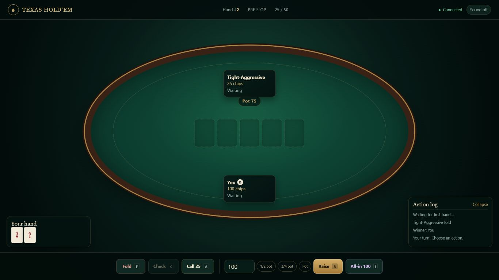
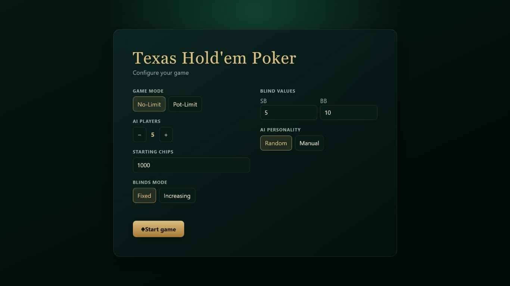
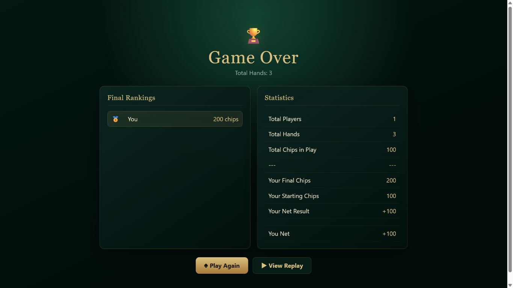

# Texas Hold'em Poker

Browser-based Texas Hold'em poker game — 1 human player vs N AI agents with LLM-enhanced decision making.

## Features

- **Full Texas Hold'em rules** — No-Limit & Pot-Limit, side pots, full hand evaluation
- **AI opponents** — 4 personality profiles (TAG / LAG / Nit / Calling Station)
- **Hybrid AI** — Rule engine + DeepSeek V4 Flash enhancement for difficult decisions
- **Real-time gameplay** — WebSocket-powered, dark casino theme
- **Replay system** — Full hand history recording with statistics (VPIP / PFR / AF)

## Screenshots

### Poker Table



| Game Setup | Game Results |
| --- | --- |
|  |  |

## Quick Start

Create the local secret file with the command for your shell:

```powershell
# Windows PowerShell
Copy-Item .env.example .env
```

```bash
# macOS, Linux, or Git Bash
cp .env.example .env
```

Edit `.env` and replace the placeholder with your DeepSeek API key:

```dotenv
DEEPSEEK_API_KEY=your-key-here
```

Then install dependencies and start the server:

```bash
# Install dependencies
pip install -r requirements.txt

# Start server
python -m uvicorn server.main:app --host 127.0.0.1 --port 8000

# Open browser
# http://127.0.0.1:8000
```

## Configuration

Store the API key only in the project-root `.env` file. The application loads
this file during startup, and Git ignores it. Never commit `.env` or place a
literal API key in a tracked configuration file.

Use `config/llm_config.yaml` only to tune the DeepSeek model and trigger
thresholds. Keep the API key as an environment-variable reference:

```yaml
model: deepseek-v4-flash
api_key: ${DEEPSEEK_API_KEY}
max_tokens: 500
timeout_seconds: 30
```

Restart the server after changing `.env` or `config/llm_config.yaml`.

## Project Structure

```
Texas_Poker/
├── server/
│   ├── main.py              # FastAPI entry point
│   ├── engine/              # Game engine (deck, evaluator, betting, pot, dealer, controller)
│   ├── ai/                  # AI system (rule engine, personality, prompts, manager)
│   ├── llm/                 # DeepSeek Chat Completions adapter
│   ├── replay/              # Replay logger & playback
│   ├── ws/                  # WebSocket manager
│   └── models/              # Pydantic data models
├── frontend/
│   ├── index.html           # SPA entry
│   ├── css/                 # Modular setup, game, and results styles
│   └── js/                  # Client-side modules
├── config/                  # YAML configuration
├── replays/                 # Saved game replays (JSON)
└── spec.md                  # Full specification
```

## API

| Method | Path | Description |
|--------|------|-------------|
| `POST` | `/api/game/start` | Start a new game |
| `GET` | `/api/replays` | List saved replays |
| `GET` | `/api/replay/{id}` | Load replay data |
| `WS` | `/ws/{game_id}` | Real-time game connection |

## Tech Stack

- **Backend:** Python / FastAPI / WebSocket
- **Frontend:** Vanilla HTML / CSS / JavaScript
- **LLM:** DeepSeek V4 Flash via the OpenAI-compatible Chat Completions API
- **Storage:** JSON replay files
